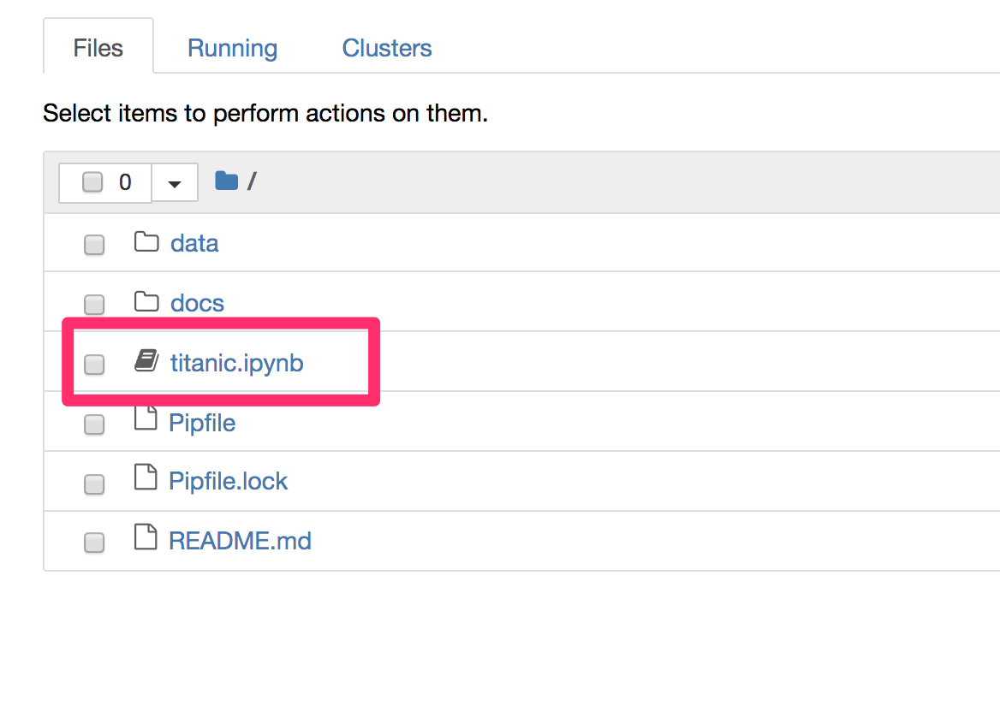
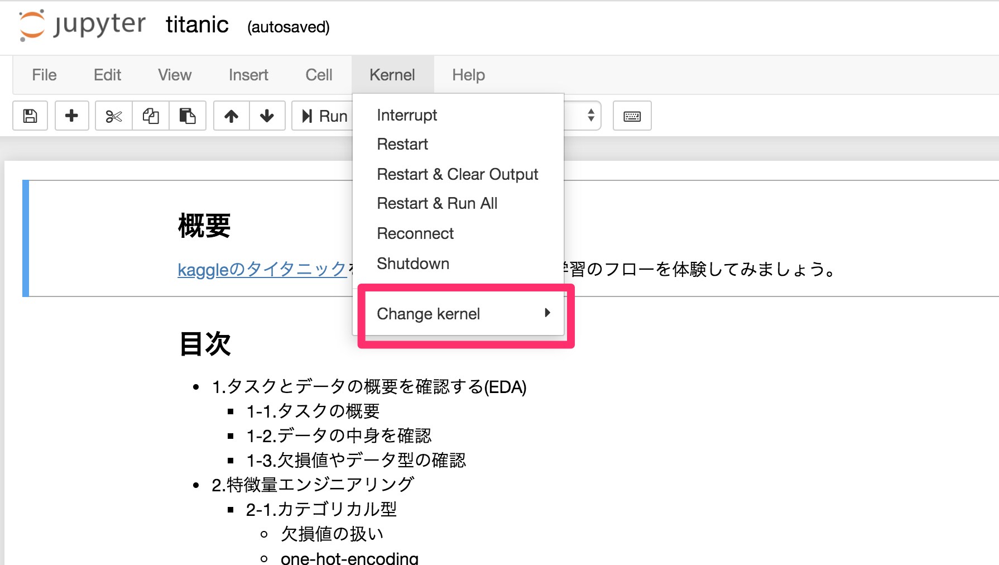

## 概要

[kaggle](https://www.kaggle.com/c/titanic)のタイタニックデータを使って機械学習をやってみよう！！！  

## 最初に
今回は「Pipenv」で仮想環境を構築して、そこで実行していきます。  
手順は下記の通りです。  

### 1.pipenvのインストール

```
$ # インストール確認（入っていないようなら、インストールが必要）
$ pipenv --version

$ # インストールされていないようならインストール
$ brew install pipenv
```

### 2.pipenvで環境を作成

```
$ # リポジトリをclone
$ git clone https://github.com/cm-yoshim/cm_da_study.git
$ # ディレクトリ移動
$ cd ml_handson
$ pipenv install -d
```

### 3.今作った仮想環境がJupyter nontebookで参照できるようにカーネルパスを通す

```
$ # 仮想環境のアクティベート
$ pipenv shell
$ # パスを通す
$ python -m ipykernel install --user --name=`basename $VIRTUAL_ENV`
$ # jupyter labの起動
$ jupyter lab
```

### 4.notebookファイルを開いて、カーネルを合わせる
こいつをクリックして開いて  


ここから先ほどパスを通したカーネルを指定する！！！　　


### 5.利用が終わったら

```
$ # 仮想環境を閉じる
$ exit
```

### 6.仮想環境の削除（オプション）
この環境が不要になったら、仮想環境を削除しましょう。

```
$ # 対象のディレクトリに移動
$ cd ml_handson
$ # 仮想環境の削除
$ pipenv --rm
$ # jupyterで参照するためにカーネルのパスを作成したが、仮想環境を削除したら不要なので削除
$ rm -r /Users/<user-name>/Library/Jupyter/kernels/<kernael-name>
```